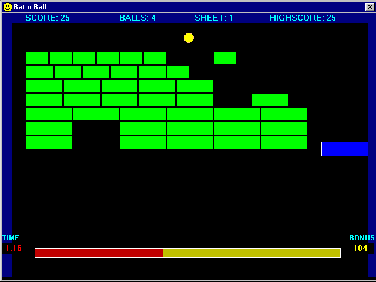



## Five Apps

### Description

5 VB6 Projects all built on a single form.

including:

Runes - The Viking method of forecasting the future.

Bat n ball - A breakout like game.

Clock - Analog alarm clock timer.

Pairs - Memory game, match the pairs.

Space Invaders - The classic reinvented.
 
### More Info
 

             |
---                |---
**Submitted On**   |2000-06-28 20:41:06
**By**             |[Jim Cook](https://github.com/Planet-Source-Code/PSCIndex/blob/master/ByAuthor/jim-cook.md)
**Level**          |Intermediate
**User Rating**    |3.8 (15 globes from 4 users)
**Compatibility**  |VB 5\.0, VB 6\.0
**Category**       |[Complete Applications](https://github.com/Planet-Source-Code/PSCIndex/blob/master/ByCategory/complete-applications__1-27.md)
**World**          |[Visual Basic](https://github.com/Planet-Source-Code/PSCIndex/blob/master/ByWorld/visual-basic.md)
**Archive File**   |[CODE\_UPLOAD7561792000\.zip](https://github.com/Planet-Source-Code/jim-cook-five-apps__1-9622/archive/master.zip)

